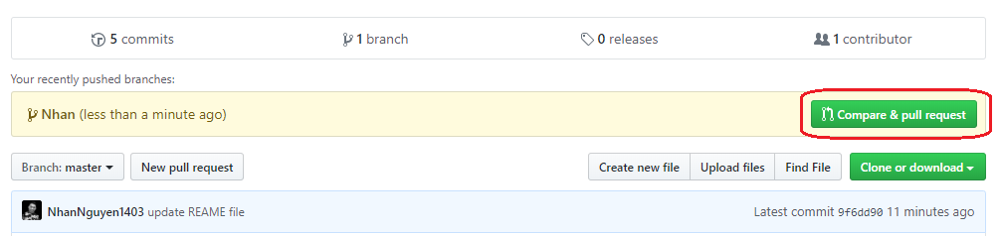
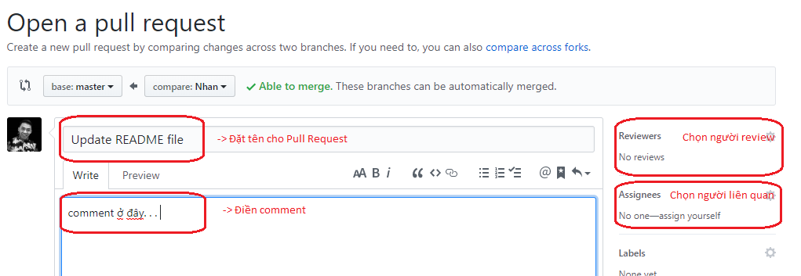

# Cấu trúc
- Bao gồm: 202 files (202 context)

# Hướng dẫn về Git

**1. mỗi người sẽ tạo ra một nhánh cho riêng mình (phải tạo từ nhánh master).**

**2. Lấy code về**

**3. Chọn những files đã chỉnh sửa để commit**

**4. Chọn đúng nhánh của mình để commit, KHÔNG CHỌN NHÁNH MASTER**

**5. Thêm comment vào commit và commit lên đúng nhánh đã chọn**

**6. Push commit vừa rồi lên nhánh**

**7. Mở trình duyệt và đăng nhập vào [Git](https://github.com/NhanNguyen1403/QA-vi-data) và tạo Pull Request**

**8. Đặt tên Pull Request, điền mô tả, chọn người review, chọn người liên quan**

# Hướng dẫn thao tác:

**1. Hiểu ngữ cảnh**

**2. Đặt câu hỏi**

**3. Trích câu trả lời từ ngữ cảnh và gán giá trị vị trí bắt đầu cho câu trả lời**

