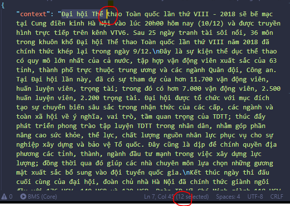

# Cấu trúc:
- Bao gồm: 202 files (202 context)

# Hướng dẫn về Git
###1. mỗi người sẽ tạo ra một nhánh cho riêng mình (phải tạo từ nhánh master).

###2. Lấy code về

###3. **Chỉ commit những file đã chỉnh sửa**

# Hướng dẫn thao tác:
###1. Hiểu ngữ cảnh

###2. Đặt câu hỏi

###3. Trích câu trả lời từ ngữ cảnh và gán giá trị vị trí bắt đầu cho câu trả lời
